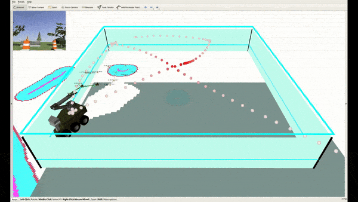

================
FKIE NBV Planner
================

Description
-----------

The ``fkie_nbv_planner`` package provides view poses for online next-best-view
planning to perform 3D Exploration and Inspection tasks using a mobile
manipulator robot. 

Checkout the teaser video on `YouTube <https://www.youtube.com/watch?v=nsJ_LCio0h0>`_:

Citation
--------

If you use this work for scientific purposes, please consider to reference the following article:

.. code-block:: bibtex

    @ARTICLE{9695293,
      author={Naazare, Menaka and Rosas, Francisco Garcia and Schulz, Dirk},
      journal={IEEE Robotics and Automation Letters}, 
      title={Online Next-Best-View Planner for 3D-Exploration and Inspection With a Mobile Manipulator Robot}, 
      year={2022},
      volume={7},
      number={2},
      pages={3779-3786},
      doi={10.1109/LRA.2022.3146558}
    }

The article can be found on `IEEE Xplore <https://ieeexplore.ieee.org/abstract/document/9695293>`_ and 
`arXiv <https://arxiv.org/pdf/2203.10113.pdf>`_.

Requirements
------------

This package has been tested on Ubuntu 20.04 and ROS Noetic 

Installation
------------

- Install all dependencies:

  .. code-block:: shell

      sudo apt install libcgal-dev libeigen3-dev ros-noetic-gps-common ros-noetic-octomap \
                       ros-noetic-octomap-msgs ros-noetic-octomap-server \
                       ros-noetic-octomap-rviz-plugins ros-noetic-tf ros-noetic-tf2 \
                       ros-noetic-tf2-geometry-msgs ros-noetic-visualization-msgs \
                       ros-noetic-jsk-rviz-plugins \
                       ros-noetic-grid-map-core \
                       ros-noetic-grid-map-ros

- Clone and build the custom packages

  .. code-block:: shell

      cd ${your_ros_workspace}
      git -C src clone https://github.com/fkie/fkie_ddynamic_reconfigure.git
      git -C src clone https://github.com/fkie/fkie-nbv-planner.git
      git -C src clone https://github.com/fkie/fkie_environmental_measurements.git
      catkin build fkie-nbv-planner

Try it out!
-----------

We highly recommend using `fkie_node_manager <https://github.com/fkie/multimaster_fkie>`_ for managing the ROS nodes. 
``run_planner.launch`` starts the next-best-view planner:

.. code-block:: shell

      roslaunch fkie_nbv_planner run_planner.launch

Project status
--------------

We are currently working on the Noetic version of the complete system that can
demonstrate the execution of the planner with a `husky base and a panda arm
<https://github.com/fkie/fkie_husky_manipulation_simulation>`_ using behavior
trees. The complete system is planned to be available by the end of June 2022. 

Acknowledgements
----------------

Our work builds upon ideas already presented in the literature:

- AEPlanner [`IEEE <https://ieeexplore.ieee.org/document/8633925>`_  | `GitHub <https://github.com/mseln/aeplanner>`_]
- RH-NBVP [`IEEE <https://ieeexplore.ieee.org/document/7487281>`_ | `GitHub <https://github.com/ethz-asl/nbvplanner>`_]
- mav_active_3D_planning [`IEEE <https://ieeexplore.ieee.org/document/8968434>`_ | `GitHub <https://github.com/ethz-asl/mav_active_3d_planning>`_]

Authors
-------

- Menaka Naazare (`E-Mail <mailto:menaka.naazare@fkie.fraunhofer.de>`_)
- Francisco Garcia Rosas (`Email <mailto:francisco.garcia.rosas@fkie.fraunhofer.de>`_)

