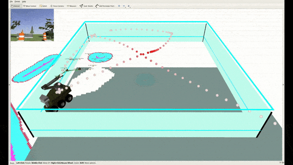

================
FKIE NBV Planner
================

Description
-----------

The ``fkie_nbv_planner`` package provides view poses for online next-best-view
planning to perform 3D Exploration and Inspection tasks using a mobile
manipulator robot. 

Checkout the teaser video on `YouTube <https://www.youtube.com/watch?v=nsJ_LCio0h0>`_:

Citation
--------

If you use this work for scientific purposes, please consider to reference the following article:

.. code-block:: bibtex

    @ARTICLE{9695293,
      author={Naazare, Menaka and Rosas, Francisco Garcia and Schulz, Dirk},
      journal={IEEE Robotics and Automation Letters}, 
      title={Online Next-Best-View Planner for 3D-Exploration and Inspection With a Mobile Manipulator Robot}, 
      year={2022},
      volume={7},
      number={2},
      pages={3779-3786},
      doi={10.1109/LRA.2022.3146558}
    }

The article can be found on `IEEE Xplore <https://ieeexplore.ieee.org/abstract/document/9695293>`_ and 
`arXiv <https://arxiv.org/pdf/2203.10113.pdf>`_.

Requirements
------------

This package has been tested on Ubuntu 20.04 and ROS Noetic.

Installation
------------

- Install all dependencies:

  .. code-block:: shell

      sudo apt install libcgal-dev libeigen3-dev ros-noetic-gps-common ros-noetic-octomap \
                       ros-noetic-octomap-msgs ros-noetic-octomap-server \
                       ros-noetic-octomap-rviz-plugins ros-noetic-tf ros-noetic-tf2 \
                       ros-noetic-tf2-geometry-msgs ros-noetic-visualization-msgs \
                       ros-noetic-jsk-rviz-plugins

- Clone and build the custom packages

  .. code-block:: shell

      cd ${your_ros_workspace}
      git -C src clone https://github.com/fkie/fkie_ddynamic_reconfigure.git
      git -C src clone https://github.com/fkie/fkie-nbv-planner.git
      git -C src clone https://github.com/fkie/fkie_environmental_measurements.git
      catkin build fkie-nbv-planner

Try it out!
-----------

``run_planner.launch`` starts the next-best-view planner:

.. code-block:: shell

      roslaunch fkie_nbv_planner run_planner.launch

The planner is implemented as an action server which accepts action client requests
(not in the repository, refer to `SimpleActionClient Tutorial <https://wiki.ros.org/actionlib_tutorials/Tutorials/SimpleActionClient>`_)
with an exploration boundary and measured readings of the ROI (See `NbvPlanner.action <https://github.com/fkie/fkie-nbv-planner/blob/main/action/NbvPlanner.action>`_).

An example exploration boundary and measured readings can be obtained from the
`fkie_measurement_server <https://github.com/fkie/fkie_environmental_measurements/tree/main/fkie_measurement_server>`_
package using an action client (See `RequestBoundaryPolygons.action
<https://github.com/fkie/fkie_environmental_measurements/blob/main/fkie_measurement_msgs/action/RequestBoundaryPolygons.action>`_).

The following topics are required as inputs for the planner:

- ``octomap_full`` (`octomap_msgs/Octomap <https://docs.ros.org/en/api/octomap_msgs/html/msg/Octomap.html>`_):
  The octomap server subscribes ``/clock``, ``/tf``, ``/tf_static`` and ``/realsense/depth/points2`` (`sensor_msgs/PointCloud2 <https://docs.ros.org/en/noetic/api/sensor_msgs/html/msg/PointCloud2.html>`_)
  to publish ``octomap_full``.

  The pointclouds on ``/realsense/depth/points2`` are generated from
  `depth_image_proc <https://wiki.ros.org/depth_image_proc>`_ (Line 10 in `perception.launch <https://github.com/fkie/fkie-nbv-planner/blob/b009c69f2466e23ae92ae2f6bbb2663433942b7f/launch/perception.launch#L10>`_)
  using a simulated RealSense camera (available `here <https://github.com/pal-robotics/realsense_gazebo_plugin>`_)
  using the depth image and camera info topic.

- ``camera_pose`` (`geometry_msgs/PoseStamped <https://docs.ros.org/en/noetic/api/geometry_msgs/html/msg/PoseStamped.html>`_):
  Pose of the camera in world frame as Posestamped messages.

- ``${arg robot_ns}_mbf/global_costmap/footprint`` (`geometry_msgs/PolygonStamped <https://docs.ros.org/en/noetic/api/geometry_msgs/html/msg/PolygonStamped.html>`_):
  Robot footprint to avoid generating invalid samples.
  We used `move_base_flex <https://wiki.ros.org/move_base_flex>`_ for platform navigation.

Acknowledgements
----------------

Our work builds upon ideas already presented in the literature:

- AEPlanner [`IEEE <https://ieeexplore.ieee.org/document/8633925>`__  | `GitHub <https://github.com/mseln/aeplanner>`__]
- RH-NBVP [`IEEE <https://ieeexplore.ieee.org/document/7487281>`__ | `GitHub <https://github.com/ethz-asl/nbvplanner>`__]
- mav_active_3D_planning [`IEEE <https://ieeexplore.ieee.org/document/8968434>`__ | `GitHub <https://github.com/ethz-asl/mav_active_3d_planning>`__]

Authors
-------

- Menaka Wildt (`E-Mail <mailto:menaka.wildt@fkie.fraunhofer.de>`_)
- Francisco Garcia Rosas

